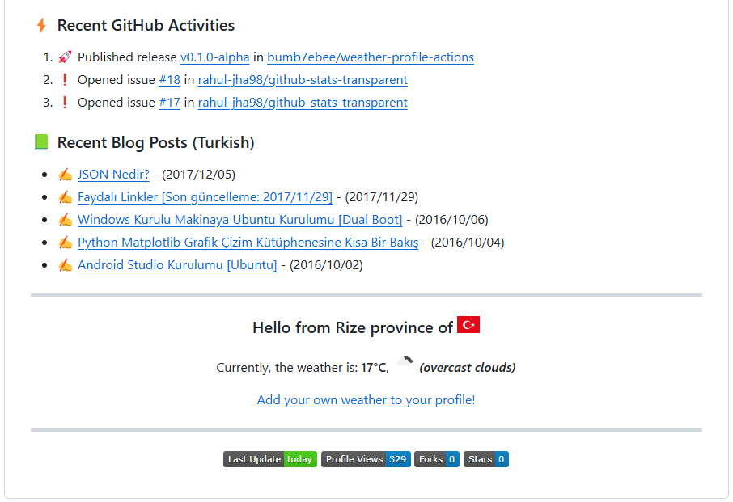

<p align="center">
  
  <h1 align="center">Weather in README</h1>
</p>
<p align="center">
  Updates your README.md file with the weather of a city
</p>

<p align="center">
  
  
  
  
</p>

<!--
<picture>
  <source media="(prefers-color-scheme: dark)" srcset="assets/screenshot/partial-dark.png"/>
  <source media="(prefers-color-scheme: light)" srcset="assets/screenshot/partial-light.png"/>
  
</picture>
-->

> [!CAUTION]
> This repo is in preview release. It may contain bugs. Please open an issue for any feedback. Thanks for your understanding.

### ⚙️ How to use?
1. Star this repo 😉
2. Obtain an API key from [OpenWeather](https://openweathermap.org/)
3. Go to your repository
4. Go to your repository's `Settings`
5. Add a new repository secret named `WEATHER_API_KEY` containing your API key for `Actions` in `Secrets and variables`
6. Add the following section to your README.md file. The workflow will replace this comment with the weather:
```markdown
<!-- WEATHER:START -->
<!-- WEATHER:END -->
```
7. Create a folder named `.github` and create a `workflows` folder inside it, if it doesn't exist.
8. Create a new file named `weather-profile-workflow.yml` with the following contents inside the workflows folder:
```yml
name: Update Weather
on:
  schedule: # run workflow automatically
    - cron: '0 */3 * * *' # runs every three hours
  # allows you to run this workflow manually from the Actions tab
  workflow_dispatch:
permissions:
  contents: write # to write the generated contents to the README
jobs:
  build:
    name: Update this repo's README with recent weather
    runs-on: ubuntu-latest
    steps:
      - name: Checkout
        uses: actions/checkout@v4
      - name: Pull in weather data
        uses: bumb7ebee/weather-profile-actions@v1
        with:
          weather-api-key: ${{ secrets.WEATHER_API_KEY }} # secret variable of OpenWeather API KEY
          city-id: 740483 # city id obtained from OpenWeather
          units: c # c (centigrade) or f (fahrenheit)
          country-code: tr # country code obtained from https://flagicons.lipis.dev/
          readme-path: README.md # relative path of the README file. something like: README, README.md, src/README, src/README.md, etc.
```
9. Wait for it to run automatically, or you can also trigger it manually to see the result instantly.

### 🔧 Options
This workflow has options that you can use to customize it for your use case. The following are the list of options available:
| Option                         | Default Value                  | Required   | Description                                                                                                                                                                                                                                                |
| :----------------------------- | :----------------------------- | :--------: | :--------------------------------------------------------------------------------------------------------------------------------------------------------------------------------------------------------------------------------------------------------- |
| `weather-api-key`              | `""`                           | Yes        | Secret variable of OpenWeather API KEY                                                                                                                                                                                                                     |
| `city-id`                      | `""`                           | Yes        | City ID obtained from OpenWeather                                                                                                                                                                                                                          |
| `units`                        | `""`                           | Yes        | c (centigrade) or f (fahrenheit)                                                                                                                                                                                                                           |
| `country-code`                 | `""`                           | Yes        | Country code obtained from https://flagicons.lipis.dev/                                                                                                                                                                                                    |
| `readme-path`                  | `""`                           | Yes        | Relative path of the README file. something like: README, README.md, src/README, src/README.md, etc.                                                                                                                                                       |

### 🤔 Why I decided to develop these actions?
I had the idea of creating an actions for learning purposes for a while.
When I took a quick look at the actions in Marketplace, I saw that almost all actions are trying to be written in web frameworks like Nodejs or React.
I am a system programmer; I don't know web frameworks like Node.js or React. Sometimes I use Python language for scripting purposes to automate my daily work.
So I pursued the idea of how an action could be written with Python. I am not a Python guru or pro.
I am open to any kind of contribution, and I would appreciate your contributions.

### 🤗 Contributing
Contributions are welcome! Feel free to open an issue or submit a pull request if you want to improve this project 💪💪💪  
Make sure your request is meaningful and you have tested the app locally before submitting a pull request 🙏

### 🙋‍♂️ Support
💙 If you like this project, give it a ⭐ and share it with friends!

<!--
<p align="left">
  <a href="https://github.com/sponsors/bumb7ebee"></a>
</p>
-->

<!--
[☕ Buy me a coffee](https://ko-fi.com/bumb7ebee)
[☕ Buy me a coffee](https://buymeacoffee.com/bumb7ebee)
-->

### 📌 Related Projects
[https://github.com/thmsgbrt/thmsgbrt](https://github.com/thmsgbrt/thmsgbrt)  
[https://github.com/huantt/weather-forecast](https://github.com/huantt/weather-forecast)

### 📄 LICENSE
This product is licensed under the [MIT License](LICENSE).

### 👏 Contributors:
<a href="https://github.com/bumb7ebee/weather-profile-actions/graphs/contributors">
  
</a>

---

<p align="center">Made with ❤️ and </p>
